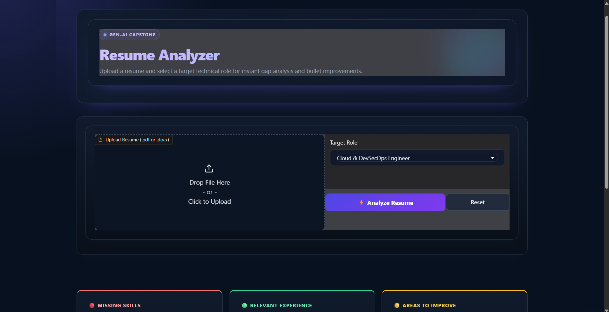

# Resume Analyzer

A Gen-AI capstone app that compares a resume with role-specific benchmarks and gives actionable feedback.

## Features

- Accepts PDF and DOCX resumes.
- Reports missing skills, relevant experience, and areas to improve.
- Supports six technical roles:
  - Cloud & DevSecOps Engineer
  - Software Engineer
  - Data Analyst
  - AI/ML Engineer
  - Cybersecurity Engineer
  - Game Developer
- Uses a local knowledge base and Hugging Face embeddings, with a configurable chat API for generating feedback.

## Setup

Requires Python 3.10 or newer. From the project directory, create a virtual environment and install the dependencies:

```powershell
py -m venv .venv
.\.venv\Scripts\Activate.ps1
python -m pip install --upgrade pip
python -m pip install -r requirements.txt
```

### Configure the API

The app loads `.env` from the project directory. Add your API key there:

```text
NEXUS_API_KEY=your-api-key
```

`BASE_URL` and `MODEL_NAME` are optional; the app uses the defaults configured in `app.py` when they are omitted. Keep `.env` private and do not commit it.

### Access the app and get results

Start the app:

```powershell
python app.py
```

When Gradio starts, open the local URL printed in the terminal. If port 7860 is busy, Gradio will select another available port. Keep the terminal running while you use the app.

1. Upload a PDF or DOCX resume. You can try the included [sample resume](./sample_resume.docx).
2. Select a target role.
3. Click **Analyze Resume**.
4. Review the **Missing Skills**, **Relevant Experience**, and **Areas to Improve** cards.

The app builds its knowledge-base index during startup. The local embedding model may download the first time it runs.

## Screenshot



## Knowledge Base

The `knowledge_base/` directory contains the role benchmarks and resume-improvement rubric. The app indexes `.txt` and `.md` files there. Edit or add files to change the analysis guidance, then restart the app to rebuild the index. Default knowledge-base files are created when missing and are not overwritten.

## Privacy and limitations

- Resume content is sent to the configured chat API to generate feedback. The embedding model runs locally.
- Scanned or image-only PDFs are not supported because the app does not use OCR.
- Review generated suggestions before applying them; feedback depends on the resume, knowledge base, and model response.

## Team

- Musani Likith Reddy
- Sahid Saroj Bastia 
- Aditya Kumar Singh 
