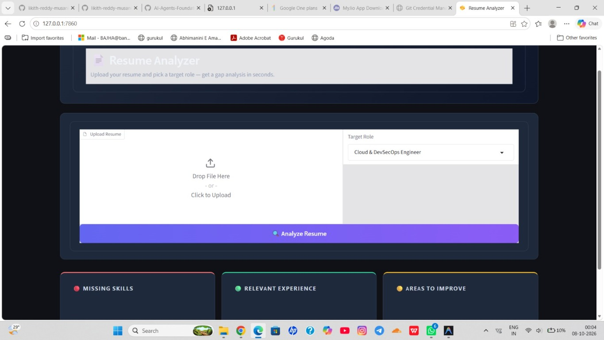

# GEN AI CAPSTONE PROJECT

## Problem Statement 📄 : 
Students often receive resumes with different formats an quickly identify missing skills, relevant experience, and area be improved.

## Project Details:
Resume Analyzer is a Gradio web app that reviews a resume against a selected
technical role. It retrieves relevant role benchmarks and resume-improvement
guidance, then uses a language model to produce a role-specific report.

## 📸 Screenshot



## 👥 Team Members

- Musani Likith Reddy (RA2511028020082)
- Sahid Saroj Bastia (RA2511028020086)
- Aditya Kumar Singh (RA2511028020094)

## ✨ Features

- Accepts PDF and DOCX resumes.
- Compares resumes with benchmarks for six technical roles.
- Presents missing or unclear skills, relevant experience, and improvement
	suggestions in separate result panels.
- Uses a local text knowledge base, Chroma vector search, and a configurable
	OpenAI-compatible API for embeddings and chat completions.

## 🎯 Supported Roles

- Cloud & DevSecOps Engineer
- Software Engineer
- Data Analyst
- AI/ML Engineer
- Cybersecurity Engineer
- Game Developer

## 🔎 How Analysis Works

1. The app extracts text from the uploaded PDF or DOCX and splits it into
	 overlapping chunks.
2. It searches the role benchmark and resume-improvement rubric for relevant
	 passages.
3. It uses the benchmark to retrieve matching passages from the resume.
4. It sends the selected role and retrieved text to the configured chat model,
	 which generates the report shown in the interface.

The knowledge-base vector store is held in memory and rebuilt when the app
starts.

## ⚙️ Setup

Requires Python 3.10 or newer. From the project directory, create a virtual
environment and install the dependencies:

```powershell
py -m venv .venv
.\.venv\Scripts\Activate.ps1
python -m pip install --upgrade pip
python -m pip install -r requirements.txt
```

## 🔐 Configure the API

The app reads its API key from the `NEXUS_API_KEY` environment variable. In
PowerShell, set it in the terminal where you will run the app:

```powershell
$env:NEXUS_API_KEY = "your-api-key"
```

The variable applies only to that PowerShell session. Do not put a real key in
source code, a committed file, or a shared screenshot. The `.gitignore` ignores
`.env` files, but this app does not load `.env` automatically.

The default `BASE_URL`, `MODEL_NAME`, and `EMBEDDING_MODEL` are configured near
the top of `app.py`. Change them to values supported by your OpenAI-compatible
API provider. The app uses the API for both embeddings and chat completions.
If a real key was committed or shared, revoke it and create a replacement;
removing it from the latest file does not erase it from Git history.

An optional Hugging Face embeddings fallback is included as commented code in
`app.py`. To use it, enable the fallback code path and disable the API-based
embeddings initialization. Its model may download the first time it runs.

## 🚀 Run

```powershell
python app.py
```

On startup, the app prepares the knowledge base and builds its vector index.
Gradio prints a local URL in the terminal. Open it in a browser, upload a PDF or
DOCX resume, select a target role, and click **Analyze Resume**.

## 📚 Knowledge Base

The `knowledge_base/` directory contains role benchmarks and a resume
improvement rubric. The app indexes `.txt` and `.md` files in this directory.
Edit these files or add new ones to change the material used for analysis.
Default files are created if missing; files that already exist are not
overwritten. Restart the app after editing the knowledge base so it rebuilds
the index.

## 🛡️ Privacy and Limitations

- Resume text is sent to the configured embeddings and chat API endpoints. Do
	not upload sensitive information unless you are authorized to share it with
	that provider.
- Scanned or image-only PDFs are not supported because the app extracts text
	without OCR.
- Generated feedback depends on the uploaded text, knowledge-base content, and
	model response. Review suggestions before using them.
- The configured provider must support the selected chat and embedding models.
	Authentication, endpoint, or model configuration errors are shown in the
	app's status area.

## 📂 Project Files

```text
app.py                              Gradio interface and analysis pipeline
requirements.txt                    Python dependencies
knowledge_base/                     Role benchmarks and improvement rubric
```

